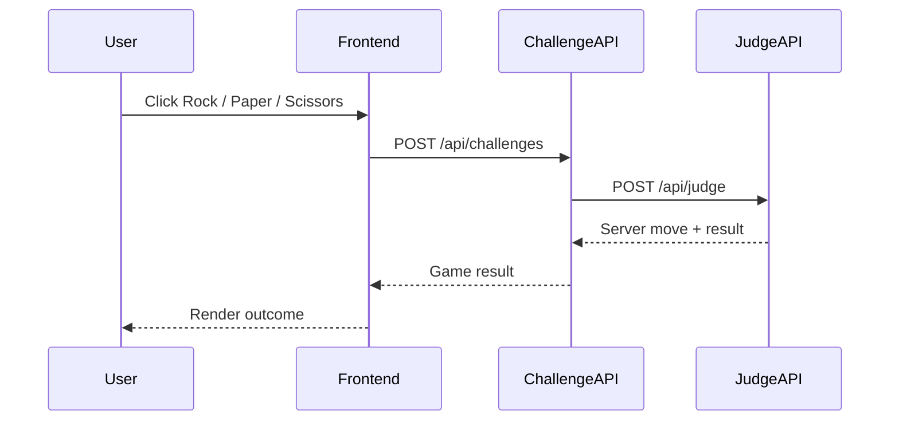

# kube-hello-kiali

Small k3s + Argo CD + Istio/Kiali demo for observing east-west traffic.

This repository contains a rock-paper-scissors application with one React frontend and two backend services:

```text
browser -> Traefik -> frontend -> challenge-api -> judge-api
```

Istio is intended to handle only in-cluster east-west traffic. Traefik remains the north-south ingress controller.

## Sequence



## Local Test

```bash
docker compose up --build
```

Open locally:

```text
http://localhost:5173
```

## HTTPS Ingress

The Kubernetes manifests expose:

```text
https://frontend.k3s.dgkim.net
https://bff.k3s.dgkim.net
```

Both ingresses use Traefik `websecure` and cert-manager `ClusterIssuer` named `letsencrypt-prod`.
The frontend still calls the BFF through its in-cluster nginx `/api` proxy, preserving this Kiali path:

```text
frontend -> challenge-api -> judge-api
```

## Kubernetes Bootstrap

Create the GHCR pull secret:

```bash
GHCR_USER=<user> GHCR_TOKEN=<token> scripts/create-ghcr-secret.sh
```

Apply the Argo CD project and application:

```bash
REPO_URL=https://github.com/<user>/kube-hello-kiali.git scripts/bootstrap-argocd-apps.sh
```

Argo CD watches `deploy/` and syncs the Kubernetes resources.

## Images

Default manifests use placeholder images:

```text
ghcr.io/CHANGE_ME/kube-hello-kiali-frontend:latest
ghcr.io/CHANGE_ME/kube-hello-kiali-challenge-api:latest
ghcr.io/CHANGE_ME/kube-hello-kiali-judge-api:latest
```

Update these before deploying, or configure the GitHub Actions workflow with `GHCR_OWNER`.
