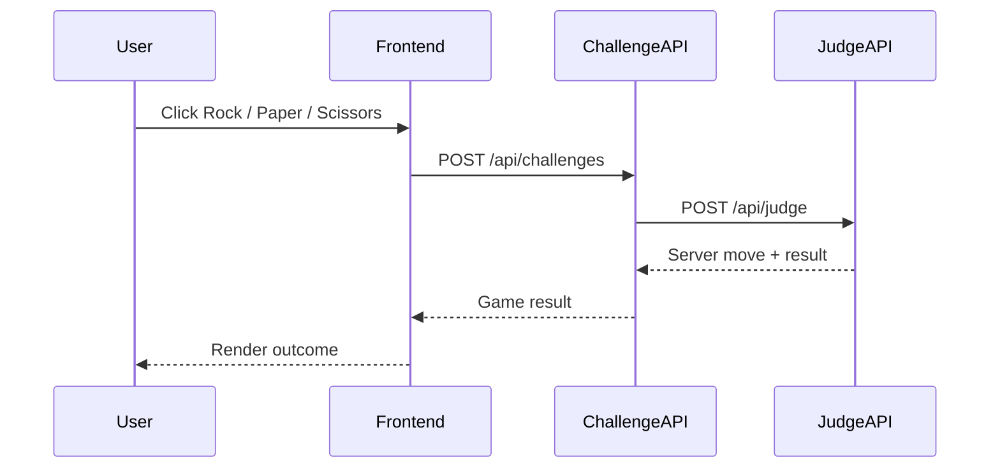

# kube-hello-kiali

Small k3s + Argo CD + Istio/Kiali demo for observing east-west traffic.

This repository contains a rock-paper-scissors application with one React frontend and two backend services:

```text
browser -> Traefik -> frontend -> challenge-api -> judge-api
```

Istio is intended to handle only in-cluster east-west traffic. Traefik remains the north-south ingress controller.

The Kubernetes runtime namespace is `rps`. Kiali filters Kubernetes-system-style namespace names such as `kube-*`, so the app intentionally avoids using `kube-hello-kiali` as the namespace.

## Sequence



## Local Test

```bash
docker compose up --build
```

Open locally:

```text
http://localhost:5173
```

## HTTPS Ingress

The Kubernetes manifests expose:

```text
https://rps.k3s-test.dgkim.net
https://rps-api.k3s-test.dgkim.net
```

Both ingresses use Traefik `websecure` and cert-manager `ClusterIssuer` named `letsencrypt-route53-prod`.
The frontend still calls the BFF through its in-cluster nginx `/api` proxy, preserving this Kiali path:

```text
frontend -> challenge-api -> judge-api
```

`challenge-api` uses permissive mTLS because it is also exposed through Traefik as the BFF. `judge-api` uses strict mTLS so the backend-to-backend hop remains mesh-enforced.

`judge-api` injects an error for about 20% of challenge requests. Both backends export OpenTelemetry traces to `http://jaeger.jaeger:4318` when Jaeger or an OTLP-compatible collector is installed. Error spans record exception events and error status so they can be inspected in Jaeger.

## Kubernetes Bootstrap

Create the GHCR pull secret:

```bash
cp env.example.sh env.sh
# edit env.sh
scripts/create-ghcr-secret.sh
```

Apply the Argo CD project and application:

```bash
scripts/bootstrap-argocd-apps.sh
```

Argo CD watches `deploy/` and syncs the Kubernetes resources.

## Images

Default manifests use placeholder images:

```text
ghcr.io/dgkim-lab/kube-hello-kiali-frontend:latest
ghcr.io/dgkim-lab/kube-hello-kiali-challenge-api:latest
ghcr.io/dgkim-lab/kube-hello-kiali-judge-api:latest
```

GitHub Actions updates these tags to the pushed commit SHA after images are built.
